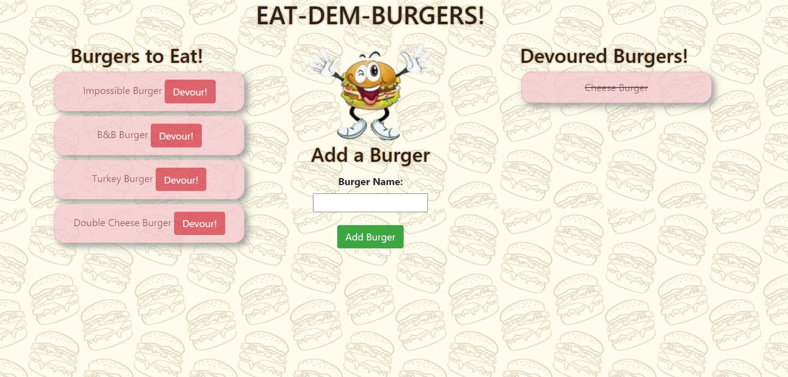

# EAT-DEM-BURGERS

## Overview:

This app is a burger logger with MySQL, Node, Express, Handlebars and ORM. It follows a MVC design pattern; using Node and MySQL to query and route data in the app, and Handlebars to generate the HTML.

### Description:

* Eat-Dem-Burger! is a restaurant app that lets users input the names of burgers they'd like to eat.

* Whenever a user submits a burger's name, this app will display the burger on the left side of the page -- waiting to be devoured.

* Each burger in the waiting area also has a `Devour!` button. When the user clicks it, the burger will move to the right side of the page.

* This app will store every burger in a database, whether devoured or not.

- - -
### __This is a link to a deployed application:__

_[Click Here for the Heroku’s Deployed Application](https://thawing-citadel-56949.herokuapp.com)_

- - -

### **This is a preview of the app**

